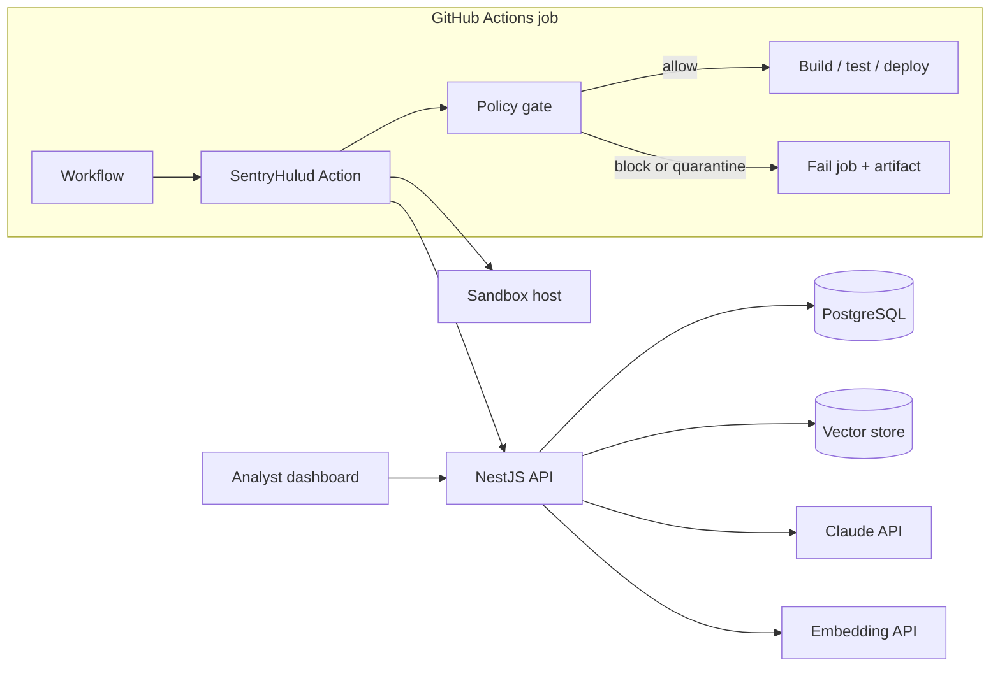
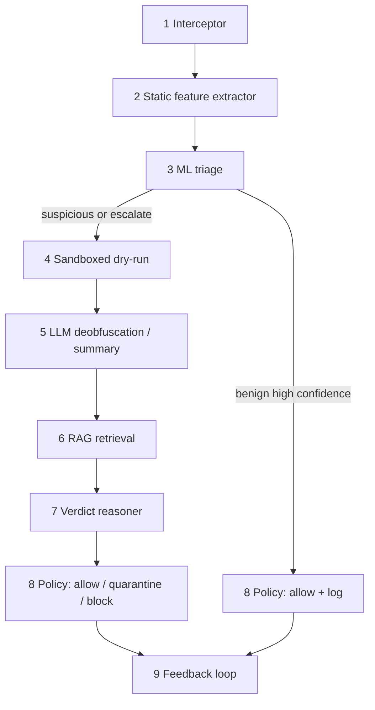

# Architecture

SentryHulud is a **nine-stage escalating pipeline** that runs inside or beside a GitHub Actions job. Cost and latency grow only when static evidence is insufficient. This document is the design counterpart to the [SRS](srs.md) and [methodology](methodology.md).

## 1. Design principles

1. **Fail closed on interception errors** (default). A worm that breaks the parser must not get a free pass.
2. **Never execute untrusted JS on the runner.** The runner only extracts, classifies, and enforces.
3. **Escalate, don't always detonate.** Most lifecycle scripts are benign; sandbox + LLM are for the tail.
4. **Reason over techniques, not only hashes.** Retrieval is keyed off a behavior summary so a new loader can still match old ATT&CK patterns.
5. **Version everything that affects a verdict.** Model, feature schema, corpus, prompt, and policy thresholds are recorded for audit and for the held-out experiment.

## 2. Context



The Action can run **standalone** (local classifier + optional remote sandbox/API) or **org-mode** (all verdicts posted to the API). Evaluation uses pinned local corpus and models.

## 3. Logical pipeline



### Stage 1 — Interceptor

A Node.js wrapper resolves the install graph from the lockfile (and, if needed, a dry `npm install --ignore-scripts --package-lock-only` style resolution). For each package it records:

- name, version, resolved URL, integrity
- `scripts.preinstall` / `install` / `postinstall`
- inlined command vs path to a file inside the tarball
- extracted script bytes (hashed; stored as artifact)

Tarball extraction happens in a scratch directory, not via `npm install`. Native `node-gyp` install scripts are still **captured**, not executed.

### Stage 2 — Static feature extractor

JavaScript is parsed with Acorn or `@babel/parser`. Features are deterministic given `(script_bytes, parser_version)`:

- Shannon entropy, printable ratio, hex/unicode escape density
- AST counts: `CallExpression` callees of interest (`eval`, `Function`, `spawn`, `exec`, `fetch`, `https.request`, `fs.readFile`, `os.homedir`)
- String-literal hits for credential paths (`.npmrc`, `.git-credentials`, `~/.ssh`, `.aws/credentials`, `GITHUB_TOKEN`, `NPM_TOKEN`) without executing the script
- Presence of download-then-execute structure (HTTP client + `chmod` / `spawn` in the same file)
- Hook type and whether the package is a known installer helper (weak prior only)

Parse failures increment `unparseable` and force **escalate**.

### Stage 3 — ML triage classifier

A gradient-boosted tree (XGBoost or LightGBM) plus a linear baseline. Labels: `benign`, `malicious` at training time; at inference the policy maps scores to `benign` / `suspicious` / `escalate`.

SHAP values are computed only for escalated or blocked cases to keep the hot path cheap.

**Training leak rule:** ChainDrop feature rows are never in `train` or `val`. See [evaluation.md](evaluation.md).

### Stage 4 — Sandboxed dry-run

Docker + gVisor (or equivalent), seccomp, no-new-privs, non-root, read-only rootfs except a tmp volume, dummy `/home/sandbox` with canary files.

Capture options (implementation may use one or both):

- `strace` / `execve` logging
- eBPF (`bcc` / `bpftrace`) for connect/open
- HTTP/DNS sinkhole that records intended destinations

The sandbox **does not** reach the real npm registry, GitHub, or cloud APIs. Egress is redirected to the sink. Canary tokens are unique per run so a later public leak can be attributed.

Output: `BehaviorLog` JSON (processes, files, net, canary_hits, timeout).

### Stage 5 — LLM deobfuscation and summarization

Inputs: truncated script (or AST-derived string constants if the file is huge), `BehaviorLog`, package metadata.  
Output: `BehaviorSummary` (structured):

- probable capabilities (credential harvest, republish, exfil, persistence, wiper)
- observables (domains, repo-description patterns, runtime download of interpreters)
- uncertainty notes (heavy obfuscation, short timeout)

This stage **must not** be used to reconstruct a working worm. Prompts instruct the model to describe capabilities at the technique level. See [ethics.md](ethics.md).

### Stage 6 — RAG retrieval

`BehaviorSummary` is embedded and queried against a versioned collection. Chunks come from vendor reports, ATT&CK technique text, and analyst notes — tagged by `campaign`, `technique`, `published_at`.

For the generalization experiment, collection `sentryhulud-vN-no-chaindrop` excludes ChainDrop documents. Production collections may include them after the experiment is frozen.

Top-k (default k = 8) chunks plus metadata go to the reasoner.

### Stage 7 — Verdict reasoner

A second LLM call (or the same model with a stricter schema) produces:

```json
{
  "risk_score": 0,
  "action": "allow | quarantine | block",
  "attack_techniques": ["T1195.002"],
  "matched_campaigns": ["shai-hulud-2.0"],
  "justification": "…",
  "citations": [{"doc_id": "…", "title": "…", "date": "…"}],
  "uncertainty": "low | medium | high"
}
```

The reasoner is instructed to **down-score** when citations are weak, and to treat valid SLSA provenance as non-exculpatory.

### Stage 8 — Policy engine

Configurable thresholds (defaults from [srs.md](srs.md) FR-POL-01). Additional hard blocks (optional):

- canary exfil observed
- spawn of downloaded interpreter + credential-path reads
- classifier malicious score above a ceiling even if the LLM is down

Actions map to GitHub step outcomes and dashboard states.

### Stage 9 — Feedback loop

Analysts correct labels in the dashboard. Corrections enqueue:

- new supervised rows for the next classifier training job
- optional corpus snippets (analyst-written, not raw malware)

Retraining is **offline** and versioned. It never mutates the frozen held-out split.

## 4. Deployment views

### 4.1 CI-only (minimal)

Action + bundled ONNX/sklearn model + fail-closed policy. No LLM: `suspicious` scripts quarantine. Suitable for air-gapped runners and as ablation (a)/(b).

### 4.2 Full (recommended)

Action → API → sandbox pool → embeddings → Claude → PostgreSQL. Dashboard for humans.

### 4.3 Research eval

Batch harness over `data/splits/` with corpus pin, no GitHub, local vector DB.

## 5. Data stores

| Store | Contents |
| --- | --- |
| PostgreSQL | Verdicts, feedback, audit, policy versions |
| Object / artifact store | Script hashes, sandbox traces, SHAP plots |
| Vector DB | Embedded TI chunks |
| Git (this repo) | Code, docs, **hashes and metadata only** — not live payloads |

## 6. Trust boundaries

```
[Untrusted] npm tarball, lifecycle JS, attacker-controlled strings
     │ extract
     ▼
[Runner] interceptor + classifier  ── no execute
     │ escalate
     ▼
[Sandbox] detonate + dummy secrets ── no real identity
     │ summary
     ▼
[LLM API] redacted text only
     │
     ▼
[Trusted] policy engine, GitHub job token (never passed to sandbox)
```

A successful sandbox escape is a product vulnerability, not an expected worm feature. See [threat-model.md](threat-model.md).

## 7. Failure modes

| Failure | Pipeline behavior |
| --- | --- |
| Lockfile missing | Fail closed |
| Parser crash | Escalate |
| Sandbox timeout | Escalate to reasoner with partial log |
| LLM outage | Heuristic verdict; `degraded` |
| Vector DB empty | Reasoner refused; quarantine |
| Embedding API down | Same as empty corpus |

## 8. Extensibility (explicitly not built)

Hooks for PyPI `setup.py` / PEP 517, GNN blast-radius, and RL threshold tuning are **out of scope**. Interfaces should still pass `ecosystem: npm` so those can attach later without rewriting the verdict schema.
