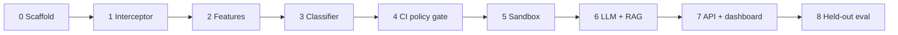

# Implementation phases

Academic calendar lives in [timeline.md](timeline.md). This document is the **engineering sequence**: what to build, in what order, and when a phase is done. Start at Phase 0. Do not skip the sandbox boundary (never execute captured scripts on the host).

Literature and the proposal are already written. Dataset collection (timeline weeks 4–6) **runs in parallel** with Phases 0–2 using synthetic fixtures until real metadata exists.

| Phase | Pipeline stages | Semester map | Demo you can show |
| --- | --- | --- | --- |
| 0 | — | S1 week 1 leftover | Repo runs tests / lint |
| 1 | 1 | S1 weeks 7–9 | Prints every lifecycle script from a lockfile, executes none |
| 2 | 2 | S1 weeks 7–9 | Feature JSON per script |
| 3 | 3 | S1 weeks 10–12 | Benign vs escalate on fixtures (no ChainDrop in train) |
| 4 | 8 (partial) | end of S1 | GitHub Action allow/block from classifier only — config **(a)** |
| 5 | 4 | S1 weeks 13–15 | Sandbox `BehaviorLog` + canary hits |
| 6 | 5–7 | S2 weeks 1–10 | Explainable verdict JSON — config **(c)** |
| 7 | 9 | S2 weeks 8–12 | Analyst override in UI |
| 8 | eval | S2 weeks 13–14 | Ablation table (a)(b)(c) |

---

## Phase 0 — Repository scaffold

**Build**

- Monorepo folders: `action/`, `classifier/`, `sandbox/`, `rag/`, `reasoner/`, `api/`, `dashboard/`, `eval/`, `fixtures/`
- Root `package.json` / `classifier/pyproject.toml` (or `requirements.txt`)
- CI that runs unit tests on fixtures only (no malware)
- Shared types: `ScriptBundle` JSON schema (name, version, hook, integrity, script hash, source path)

**Done when**

- `fixtures/benign-lockfile/` and `fixtures/synthetic-suspicious/` exist
- `npm test` / `pytest` pass on empty stubs
- README points at this phase list

**Next:** Phase 1. Dataset metadata can start filling `data/scripts/metadata.jsonl` at the same time.

---

## Phase 1 — Interceptor (stage 1)

**Build**

- Resolve npm/yarn/pnpm lockfile
- Download tarballs by integrity into a cache (read-only registry GET)
- Extract `preinstall` / `install` / `postinstall` without running them
- Emit `ScriptBundle[]` to stdout or a file

**Done when**

- On the benign fixture, you list every hook and the parent package
- A test asserts `child_process` / `npm install` is **not** used to execute those scripts
- Missing lockfile fails closed

Tarball download by integrity is issue #22 (offline CI uses on-disk `package.json` only).

**Semester 1 demo (partial):** this plus Phase 2 is the interceptor half of the S1 bar.

---

## Phase 2 — Static features (stage 2)

**Build**

- Acorn/Babel parse; fallback text features on parse failure (`unparseable` ⇒ escalate)
- Entropy, API-call counts, credential-path string hits, download-and-execute shape
- `feature_schema_version: 1.0.0`

**Done when**

- Same script bytes always produce the same feature vector
- Synthetic suspicious fixture scores higher on spawn/net/`eval` than `node-gyp`-like benign fixture
- Parse-failure path is tested

---

## Phase 3 — ML triage (stage 3)

**Build**

- Labeled rows from `data/scripts/` (generations 1–3 + benign). ChainDrop = `heldout` only
- XGBoost/LightGBM + linear baseline
- Inference: `benign` | `suspicious` | `escalate` + confidence
- Persist `model_version` with every decision

**Done when**

- Training job refuses ChainDrop rows
- Validation FPR is reported (target discussion: ≤ 2% — [srs.md](srs.md) NFR-08)
- SHAP available offline for blocked examples (not required on the hot path yet)

If the real malicious store is not ready, train on **synthetic** malicious-shaped scripts plus benign registry samples, and document that the frozen paper model comes later.

Implemented as `classifier/train.py` + `classifier/triage.py` with `model_version=triage-synth-0.1.0`. sklearn `HistGradientBoostingClassifier` + `LogisticRegression` baseline (XGBoost-compatible role without a native binary). Offline ranking via `explain.py`.

---

## Phase 4 — GitHub Action policy gate (stage 8, classifier-only)

**Build**

- Action wrapping install: scan → classify → `allow` / `quarantine` / `block`
- Defaults: score &lt; 40 allow, 40–80 quarantine, &gt; 80 block (map classifier scores onto this band)
- `fail-open: false`
- Upload `sentryhulud-verdict.json`

**Done when**

- A sample repo workflow uses the Action
- Benign fixture job goes green
- Synthetic suspicious fixture job fails the step
- This is evaluation configuration **(a)**

**Semester 1 demo bar (complete):** lockfile → scripts → features → classify → no host execution.

Implemented as `action/scan.mjs` + composite `action/action.yml` (config **a**). Risk scores come from Phase-2 `suspicion_score` mapped to 0–100; quarantine/block fail the step and write `sentryhulud-verdict.json`.

---

## Phase 5 — Sandbox (stage 4)

**Build**

- gVisor (or documented runc+VM fallback) image
- Canary npm/GitHub/cloud files; no real tokens
- Egress sinkhole; `BehaviorLog` (processes, files, net, canary_hits, timeout)
- Destroy container after each run
- Heuristic policy on the log → configuration **(b)**

**Done when**

- Synthetic script that reads a canary and opens a socket is recorded, not executed on the host
- Timeout still emits a partial log
- Docker socket is not mounted

Implemented as `sandbox/` Docker image + `run.mjs` orchestrator + `policy.mjs` (config **b**). `BehaviorLog` schema at `schemas/behavior-log.schema.json`. Fixture: `fixtures/sandbox-canary-hit/`.

---

## Phase 6 — LLM, RAG, reasoner (stages 5–7)

**Build**

- Redaction proxy before any model call
- `BehaviorSummary` JSON
- Corpus ingest with `no-chaindrop` pin ([dataset.md](dataset.md))
- Retrieval top-k + verdict JSON ([api.md](api.md))
- LLM outage ⇒ degraded heuristic (`reasoner_status: degraded`)

**Done when**

- `GET` corpus health reports `chaindrop_documents: 0` for the eval pin
- Invalid reasoner JSON ⇒ quarantine, not allow
- Configuration **(c)** runs on fixtures

Swap Claude vs a local/open model behind the same schema ([ADR 0004](adr/0004-claude-for-verdicts.md)).

Implemented as `rag/` (redact, corpus filter, retrieve, ingest, health) + `reasoner/` (summary, fixture provider, degraded fallback) + `action/scan-rag.mjs` (config **c**). Fixture corpus: `fixtures/rag-corpus/`. Schemas: `schemas/behavior-summary.schema.json`, `schemas/verdict-reasoner.schema.json`.

---

## Phase 7 — API, feedback, dashboard (stage 9)

**Build**

- NestJS + PostgreSQL: scans, verdicts, feedback
- Next.js queue: confirm-malicious / false-positive
- Feedback must not mutate `split=heldout`

**Done when**

- Action can POST a scan and the UI shows the justification
- Override is stored with analyst id and timestamp

Implemented as `api/` (NestJS + SQLite dev / PostgreSQL prod) and `dashboard/` (Next.js analyst queue). `action/post-scan.mjs` ingests local `sentryhulud-verdict.json` via `POST /v1/scans`. Schema: `schemas/verdict.schema.json`.

---

## Phase 8 — Held-out evaluation

**Build**

- `eval/run_heldout.py` for configs (a)(b)(c)
- Assert no ChainDrop docs in the eval corpus
- Metrics: precision, recall, F1, FPR, ChainDrop recall, latency ([evaluation.md](evaluation.md))
- Freeze thresholds on gen 1–3 val **before** scoring ChainDrop

**Done when**

- One results table and commit hash of the frozen pins exist for the final report

---

## What to implement first (this week)

1. Phase 0 folders + `ScriptBundle` schema + two fixtures.  
2. Phase 1 interceptor on `package-lock.json`.  
3. Keep filling `data/scripts/metadata.jsonl` without putting malware in git.

## Hard rules every phase

- No lifecycle script execution on the developer machine or the GHA runner
- No public npm publishes
- No ChainDrop in train/val or in `corpus-v*-no-chaindrop`
