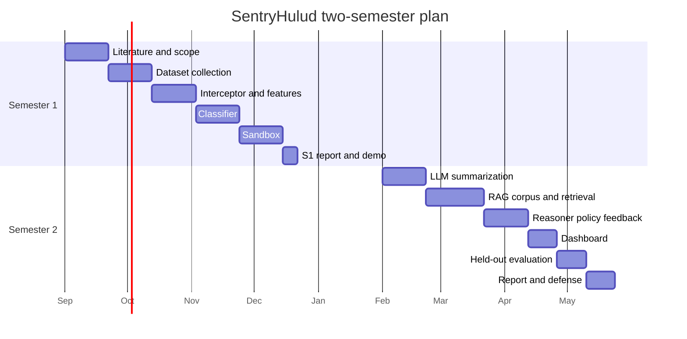

# Project timeline

Two-semester final-year project. Weeks are calendar weeks within each semester. Adjust to the department's actual term dates; the **sequence** is the constraint.

For **what to code next** (exit criteria, demos, parallel dataset work), use [implementation-phases.md](implementation-phases.md). This file is the academic calendar.

## Semester 1 — foundations and detector core

| Weeks | Milestone | Primary docs / artifacts |
| --- | --- | --- |
| 1–3 | Literature review; freeze scope and research question | [proposal.md](proposal.md), [literature-review.md](literature-review.md), [references.md](references.md) |
| 4–6 | Dataset collection: benign npm scripts + labeled malicious metadata across campaigns; split rules | [dataset.md](dataset.md), `data/scripts/metadata.jsonl` |
| 7–9 | Interceptor + static feature extractor | [architecture.md](architecture.md) stages 1–2, Action stub |
| 10–12 | ML triage classifier training and in-generation evaluation (not ChainDrop) | model artifact, SHAP notebook |
| 13–15 | Sandbox environment and behavioral capture | gVisor image, `BehaviorLog` schema |
| 16 | Semester 1 progress report and demo | interceptor + classifier demo on fixtures |

**Semester 1 demo bar:** given a fixture lockfile, list all lifecycle scripts, emit features, classify, and refuse to execute them on the host.

## Semester 2 — RAG, productization, held-out study

| Weeks | Milestone | Primary docs / artifacts |
| --- | --- | --- |
| 1–3 | LLM deobfuscation / summarization pipeline | redaction proxy, `BehaviorSummary` schema |
| 4–7 | RAG knowledge base and retrieval | `corpus-v*-no-chaindrop`, vector index |
| 8–10 | Verdict reasoner, policy engine, feedback API | [api.md](api.md), policy config |
| 11–12 | Analyst dashboard | Next.js review UI |
| 13–14 | Held-out-generation evaluation and ablation (a)(b)(c) | [evaluation.md](evaluation.md) report |
| 15–16 | Final report, documentation freeze, defense | [report-outline.md](report-outline.md) |

**Semester 2 demo bar:** GitHub Action on a sample repo blocks a synthetic worm-like fixture, allows a benign `node-gyp` install, and shows an explainable verdict. Held-out numbers may be in the report rather than live-demoed with real malware.

## Gantt (indicative)

Start dates should be replaced with the university calendar. If Semester 1 starts later than 1 Sep 2026, shift the whole chart; do not skip dataset work before the interceptor.

## Dependencies (cannot crash the critical path)

- Classifier **needs** labeled metadata (weeks 4–6).
- Sandbox **needs** interceptor output schema.
- RAG **needs** document URL list and ATT&CK texts; can overlap late S1.
- Held-out evaluation **needs** frozen corpus pin and frozen thresholds — no last-week corpus edits.

## Risk buffer

| Risk | Buffer |
| --- | --- |
| gVisor unavailable on student hardware | Fall back to heavily seccomp'd runc + dedicated VM; record as ADR |
| LLM budget | Cache summaries; run full (c) only on escalated scripts |
| Dataset access | Metadata-only malicious set + synthetic behavioral fixtures |
| ChainDrop sample count lower than expected | Report CI width; do not move ChainDrop into train |
